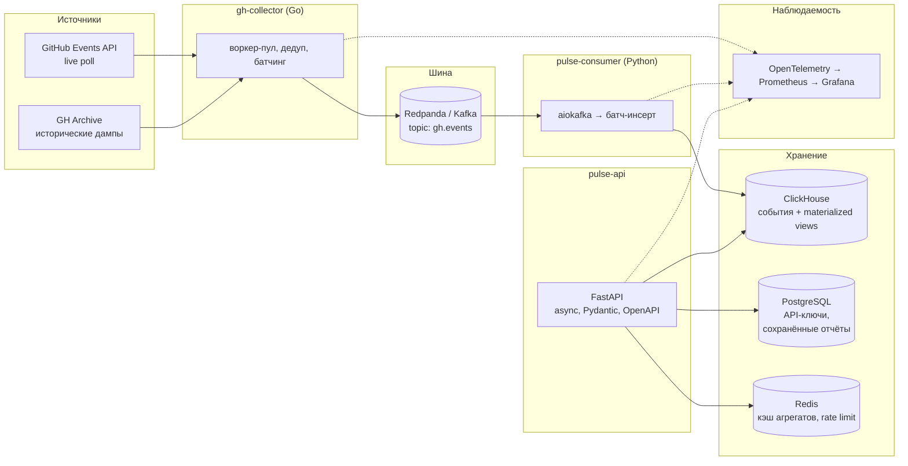

[](https://github.com/KrimsN/gh-pulse/actions)
[](https://coveralls.io/github/KrimsN/gh-pulse?branch=main)
[](LICENSE)
[](https://go.dev/)
[](https://www.python.org/)
[](https://fastapi.tiangolo.com/)
[](https://clickhouse.com/)
[](https://www.postgresql.org/)
[](https://www.redpanda.com/)
[](https://redis.io/)
[](docker-compose.yml)
[](https://docs.astral.sh/ruff/)

# GH Pulse

Real-time аналитика над публичным потоком событий GitHub. Сервис поглощает дампы
[GH Archive](https://www.gharchive.org/) и [GitHub Events API](https://api.github.com/events),
складывает события в ClickHouse и отдаёт агрегаты (тренды звёзд, языков, активности) через REST API.

## Архитектура



Три рантайм-компонента: `gh-collector` (Go) качает и продюсит события, `pulse-consumer` (Python)
вставляет их в ClickHouse батчами, `pulse-api` (FastAPI) отдаёт агрегаты. Разбор стека, схема
данных, API-контракт и обоснование каждого решения — **[docs/ARCHITECTURE.md](docs/ARCHITECTURE.md)**.

## Быстрый старт

Единственное системное требование — Docker.

```bash
git clone https://github.com/KrimsN/gh-pulse.git
cd gh-pulse
docker compose up
```

```bash
curl localhost:8000/health
```

Поднимает ClickHouse, PostgreSQL, Redpanda, Redis, Prometheus и Grafana вместе с сервисами проекта.
Топики `gh.events` и `gh.events.dlq` и схема PostgreSQL (`api_keys`, `saved_reports`) создаются при
старте — досоздавать руками ничего не нужно. Полный список портов и переменных окружения — в
[docs/ARCHITECTURE.md](docs/ARCHITECTURE.md#порты-и-переменные-окружения).

Выпуск API-ключа:

```bash
docker compose exec pulse-api python -m app.cli create-key --owner "demo" --rate-limit 100
```

По умолчанию (без `--role`) ключ не даёт доступа к `/admin` — только `X-API-Key` для `/api/v1/*`.
Первый ключ с доступом к `/admin` (и дальше — выпуск остальных ключей уже через веб-форму панели)
выпускается тем же CLI явным флагом:

```bash
docker compose exec pulse-api python -m app.cli create-key --owner "admin" --rate-limit 100 --role admin
```

Все `/api/v1/*`-эндпоинты требуют этот ключ в заголовке `X-API-Key`:

```bash
curl -H "X-API-Key: <ключ>" localhost:8000/api/v1/trending
```

## Dev-зависимости

Для `docker compose up` кроме Docker ничего не нужно. Дальше — что требуется, чтобы менять код,
гонять тесты и пользоваться скриптами репозитория напрямую (не через контейнеры).

### Обязательные

| Инструмент | Зачем |
|---|---|
| [Git](https://git-scm.com/) | Клонирование, ветвление |
| [Docker Engine](https://docs.docker.com/engine/) + Compose plugin | `docker compose up` — парадная дверь репозитория |
| [Go](https://go.dev/) 1.25+ | `services/gh-collector` |
| [golangci-lint](https://golangci-lint.run/) 2.12+ | Линтер `gh-collector`; запускается git-хуками и в CI |
| [Python](https://www.python.org/) 3.13+ и [uv](https://docs.astral.sh/uv/) | `services/pulse-consumer`, `services/pulse-api`, `bench/`, скрипты |

Версии Go и Python указаны на дату написания — перед установкой сверьтесь с официальными сайтами,
могли выйти более новые.

#### Windows

```powershell
winget install --id Git.Git -e
winget install --id Docker.DockerDesktop -e   # требует WSL2; см. Docker Desktop → Settings → WSL
winget install --id GoLang.Go -e
winget install --id GolangCI.golangci-lint -e # линтер Go; версию держим той же, что в CI
winget install --id astral-sh.uv -e           # ставит uv; Python управляется через него — см. ниже
uv python install 3.13
```

#### Ubuntu

```bash
sudo apt update
sudo apt install -y git curl ca-certificates gnupg

# Docker Engine + Compose plugin (официальный репозиторий)
sudo install -m 0755 -d /etc/apt/keyrings
curl -fsSL https://download.docker.com/linux/ubuntu/gpg | sudo gpg --dearmor -o /etc/apt/keyrings/docker.gpg
echo "deb [arch=$(dpkg --print-architecture) signed-by=/etc/apt/keyrings/docker.gpg] https://download.docker.com/linux/ubuntu $(. /etc/os-release && echo "$VERSION_CODENAME") stable" \
  | sudo tee /etc/apt/sources.list.d/docker.list > /dev/null
sudo apt update
sudo apt install -y docker-ce docker-ce-cli containerd.io docker-buildx-plugin docker-compose-plugin
sudo usermod -aG docker "$USER"   # перелогиниться, чтобы применилось

# Go (пакет в apt обычно устаревший — ставим бинарник с go.dev)
curl -LO https://go.dev/dl/go1.25.0.linux-amd64.tar.gz   # проверить актуальную версию на go.dev/dl
sudo rm -rf /usr/local/go && sudo tar -C /usr/local -xzf go1.25.0.linux-amd64.tar.gz
echo 'export PATH=$PATH:/usr/local/go/bin' >> ~/.bashrc && source ~/.bashrc

# golangci-lint — официальный скрипт ставит готовый бинарник. Через `go install` не ставим:
# он собирает линтер из исходников вашей версией Go, что авторы прямо не рекомендуют.
curl -sSfL https://golangci-lint.run/install.sh | sh -s -- -b "$(go env GOPATH)/bin" v2.12.2

# uv (сам ставит и версионирует Python — apt-python трогать не нужно)
curl -LsSf https://astral.sh/uv/install.sh | sh
uv python install 3.13
```

### Рекомендуемые (ручная отладка данных, вспомогательные скрипты репозитория)

| Инструмент | Зачем |
|---|---|
| [`clickhouse-client`](https://clickhouse.com/docs/en/integrations/sql-clients/cli) | Прогон запросов и профилирование напрямую, без API |
| `psql` (postgresql-client) | Ручной доступ к таблицам `api_keys`/`saved_reports` |
| [`jq`](https://jqlang.org/) | Осмотр сырых событий GH Archive перед изменением схемы |
| [`k6`](https://k6.io/) | Нагрузочные тесты (`bench/`, Фаза 3) |

Проще всего не ставить `clickhouse-client`/`psql` на хост отдельно, а обращаться к уже поднятым
контейнерам:

```bash
docker compose exec clickhouse clickhouse-client
docker compose exec postgres psql -U ghpulse
```

Если всё же нужны нативные бинарники на хосте:

**Windows**
```powershell
winget install --id jqlang.jq -e
winget install --id k6.k6 -e
# clickhouse-client и psql на Windows нативно неудобны — используйте docker compose exec выше
```

**Ubuntu**
```bash
sudo apt install -y jq postgresql-client

# clickhouse-client — официальный установочный скрипт (ставит локальный бинарник, root не нужен)
curl https://clickhouse.com/ | sh

# k6 — официальный репозиторий Grafana
sudo gpg --no-default-keyring --keyring /usr/share/keyrings/k6-archive-keyring.gpg \
  --keyserver hkp://keyserver.ubuntu.com:80 --recv-keys C5AD17C747E3415A3642D57D77C6C491D6AC1D69
echo "deb [signed-by=/usr/share/keyrings/k6-archive-keyring.gpg] https://dl.k6.io/deb stable main" \
  | sudo tee /etc/apt/sources.list.d/k6.list
sudo apt update && sudo apt install -y k6
```

### Проверка после установки

```bash
git --version && docker compose version && go version && golangci-lint --version && uv --version && python3 --version
```

### Git-хуки

Конфигурация — в [`.pre-commit-config.yaml`](.pre-commit-config.yaml).

| Проверка | pre-commit | pre-push |
|---|---|---|
| `ruff check`, `ruff format`, `mypy --strict` (Python-сервисы) | ✅ | ✅ |
| `pytest` (`pulse-api`/`pulse-consumer`, только изменённый сервис) | — | ✅ |
| `golangci-lint run` (`gh-collector`) | ✅ | ✅ |
| `go test -race` (`gh-collector`) | — | ✅ |

`golangci-lint` включает и `go vet`, и проверку `gofmt` (набор линтеров и обоснование каждого —
[`services/gh-collector/.golangci.yml`](services/gh-collector/.golangci.yml)), поэтому отдельных
хуков на них нет. Тесты стоят только на pre-push: на каждый промежуточный коммит они лишняя пауза,
а зелёными обязаны быть именно к пушу. `pytest` для Python-сервисов запускается отдельным хуком на
каждый — пуш, который трогает только `pulse-api`, не платит временем за testcontainers-тесты
`pulse-consumer` (реальные Redpanda и ClickHouse), и наоборот.

Установка (один раз после клонирования):

```bash
uv sync --all-packages
uv run pre-commit install
```

`uv sync` без `--all-packages` синхронизирует только корневой пакет workspace и не поставит
зависимости `pulse-api` в окружение — для локальной разработки нужна именно эта форма.

Прогнать хуки вручную по всем файлам (без коммита):

```bash
uv run pre-commit run --all-files
```

### CI

На каждый пуш и pull request [workflow](.github/workflows/ci.yml) прогоняет те же `ruff`,
`mypy --strict` и `golangci-lint`, что и хуки — с тем же конфигом и той же версией линтера, чтобы
CI не находил того, чего не находит локальный хук. Сверх хуков: `pytest`, `go build`, `go test -race`
и смоук-прогон окружения — `docker compose up --wait` и запрос к `/health`. Последний джоб держит
обещание из «Быстрого старта»: репозиторий поднимается одной командой с чистого клона.

## Технические решения

Каждое архитектурное решение зафиксировано отдельным ADR — с контекстом, отвергнутыми
альтернативами и последствиями. Полное оглавление и принцип ведения: [docs/adr/](docs/adr/README.md).

- [0001 — ClickHouse для аналитики, PostgreSQL для метаданных](docs/adr/0001-clickhouse-for-olap-postgres-for-oltp.md)
- [0002 — Go для ingest, Python для консьюмера и API](docs/adr/0002-go-for-ingest-python-for-api.md)
- [0003 — Redpanda как Kafka-совместимый брокер](docs/adr/0003-redpanda-as-kafka-broker.md)
- [0004 — At-least-once доставка, идемпотентные вставки](docs/adr/0004-at-least-once-delivery-idempotent-inserts.md)
- [0005 — Портфолио-артефакт, а не личный инструмент](docs/adr/0005-portfolio-over-personal-tool.md)
- [0006 — structlog для структурированного логирования](docs/adr/0006-structlog-for-logging.md)
- [0007 — Гибридная стратегия данных: бэкфилл до октября 2025, live-поток из настоящего](docs/adr/0007-hybrid-data-epochs.md)
- [0008 — Дизайн топика gh.events: ключ event_id, шесть партиций, retention по времени](docs/adr/0008-gh-events-topic-design.md)

## Производительность

`(заголовочные числа и GIF дашборда Grafana — в Фазе 3; живой прогресс — в TASKS.md)`

Каждое число в этом репозитории трассируется к воспроизводимому прогону бенчмарка и к коммиту,
на котором прогон сделан. Правило, формат записи и — по мере оптимизаций — сама история:
[docs/PERFORMANCE.md](docs/PERFORMANCE.md).

## Документация

- [docs/ARCHITECTURE.md](docs/ARCHITECTURE.md) — схема, стек, модель данных, API-контракт
- [docs/adr/](docs/adr/README.md) — architecture decision records
- [docs/PERFORMANCE.md](docs/PERFORMANCE.md) — история оптимизации *(наполняется по мере оптимизаций)*
- [TASKS.md](TASKS.md) — текущий статус и план работ по фазам

## Лицензия

MIT — см. [LICENSE](LICENSE).
