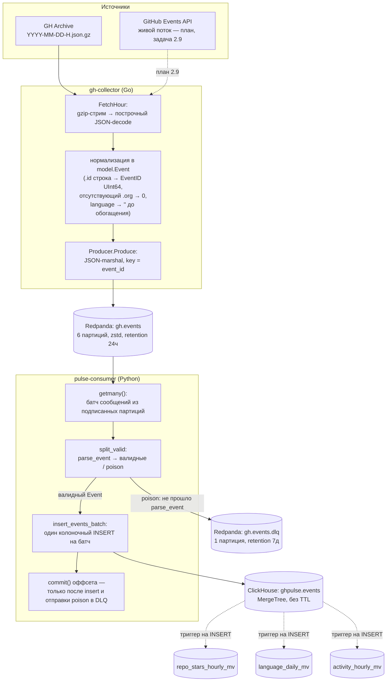
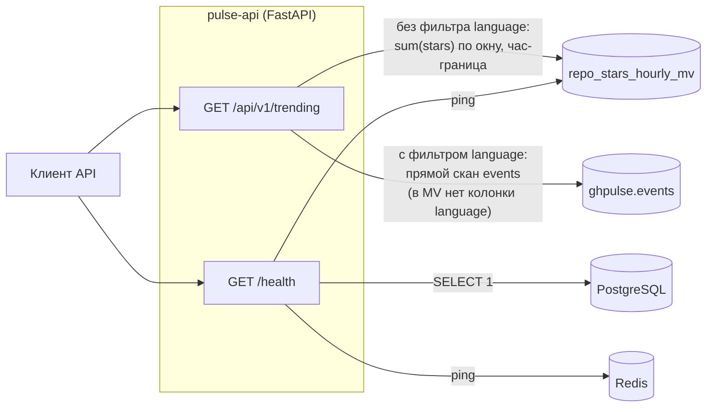
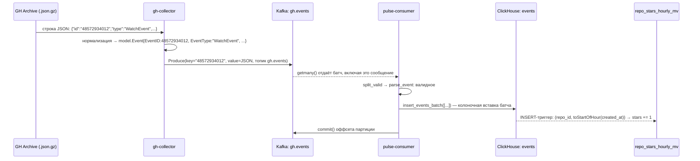

# Поток данных

Этот документ прослеживает **данные**, а не компоненты: как одно событие GitHub превращается в
строку ClickHouse и в конечном счёте — в поле JSON-ответа API. Состав сервисов, стек и порты —
в [docs/ARCHITECTURE.md](ARCHITECTURE.md); здесь то же самое устройство показано со стороны
движения данных.

Диаграммы разделены на путь записи (ingest) и путь чтения (API), потому что это две независимые
части системы: путь записи работает непрерывно и без участия клиента, путь чтения активируется
только запросом к `pulse-api`.

## Путь записи: от GitHub до ClickHouse

**Ключевые точки на этом пути:**

- **Нормализация** происходит один раз, в `gh-collector`, и только там: обе эпохи данных
  GH Archive (до/после октября 2025, [ADR 0007](adr/0007-hybrid-data-epochs.md)) и — в будущем —
  живой Events API сходятся к одной канонической форме `model.Event` ещё до Kafka. Ниже по потоку
  (`pulse-consumer`, ClickHouse) формат уже единый, разбирать эпохи там не нужно.
- **Ключ сообщения в Kafka — `event_id`**, а не `repo_id`/`actor_id`: партиционирование выбрано ради
  равномерной раскладки, а не дедупликации ([ADR 0008](adr/0008-gh-events-topic-design.md)).
- **Poison-сообщения не роняют батч.** `split_valid` отделяет то, что не прошло разбор в `Event`, и
  отправляет в `gh.events.dlq` с причиной отказа в заголовке (`x-error`) — тело остаётся байт-в-байт
  тем, что реально пришло из `gh.events`, для потенциального ручного реплея тем же кодом. Автоматического
  реплея из DLQ нет.
- **Оффсет коммитится последним.** При падении процесса между успешной вставкой и коммитом те же
  события на рестарте прочитаются и вставятся повторно — это осознанный at-least-once
  ([ADR 0004](adr/0004-at-least-once-delivery-idempotent-inserts.md)): `ghpulse.events` — обычный
  `MergeTree`, дубликаты по `event_id` не исключены на вставке, дедуп при необходимости — забота
  чтения.
- **Materialized views — это триггеры на INSERT, не отложенные представления.** Они видят только
  строки, вставленные после их создания; существовавшие на момент создания 14M+ событий были
  доначислены отдельным разовым бэкфиллом (`INSERT INTO <mv> SELECT …`, задача 2.2), а не автоматически.

## Путь чтения: от запроса к API до ответа

`/api/v1/trending` — единственный на сегодня эндпоинт, читающий данные о событиях. Он ветвится на
два пути в зависимости от параметра `language` ([app/queries.py](../services/pulse-api/app/queries.py)):

- **без фильтра** — читает `repo_stars_hourly_mv`, суммируя уже посчитанные почасовые строки;
  границы окна округляются к началу часа (`toStartOfHour`), а не считаются с точностью до секунды;
- **с фильтром `language`** — падает обратно на прямой скан `ghpulse.events`, потому что MV агрегирует
  только по `(repo_id, hour)` и не хранит язык. Поскольку обогащение языка ещё не запускалось
  (задача 4.3, измеренное покрытие 0% — [ARCHITECTURE.md](ARCHITECTURE.md#модель-данных)), этот путь
  пока не встречается в реальном трафике, но обязан отвечать корректно по контракту.

`/health` — единственное место, где `pulse-api` сегодня трогает PostgreSQL и Redis: три проверки
идут параллельно (`asyncio.gather`) и влияют только на поле `deps` ответа. Продуктовых данных через
PostgreSQL/Redis сейчас не проходит — обе базы подняты и опрашиваются на живость, но без потребителей.

### Что ещё не реализовано (Фаза 2, `TASKS.md`)

| Эндпоинт / механизм | Читал бы | Статус |
|---|---|---|
| `GET /api/v1/repos/{owner}/{name}` | `repo_stars_hourly_mv` (равенство по `repo_id`) | план — 2.4 |
| `GET /api/v1/languages/trends` | `language_daily_mv` | план — 2.4 |
| `GET /api/v1/activity/heatmap` | `activity_hourly_mv` | план — 2.4 |
| `GET /api/v1/stats` | `ghpulse.events` (размер корпуса, лаг ingest) | план — 2.4 |
| `POST/GET /api/v1/reports` | PostgreSQL `saved_reports` | план — 2.5 |
| Rate limiting и кэш агрегатов | Redis | план — 2.6 |
| Живой контур ingest | GitHub Events API → `gh-collector` | план — 2.9 |

## Жизненный цикл одного события

Конкретный пример — звезда (`WatchEvent`), от строки в архиве до строки в агрегате.

С момента продюсирования в Kafka до появления строки в `ghpulse.events` данные проходят ровно один
формат — JSON канонической схемы `model.Event`; никакой промежуточный сервис его не меняет, только
консьюмер разбирает JSON обратно в типизированные колонки для колоночной вставки.

## Где что хранится

| Хранилище | Что содержит | Пишет | Читает | Время жизни |
|---|---|---|---|---|
| Kafka `gh.events` | нормализованные события, JSON | `gh-collector` | `pulse-consumer` | 24ч (`retention.ms`) |
| Kafka `gh.events.dlq` | необработанные сообщения + причина в заголовках | `pulse-consumer` | ручной реплей (не автоматизирован) | 7 суток |
| ClickHouse `ghpulse.events` | все события с начала бэкфилла | `pulse-consumer` | `pulse-api`, три MV (по триггеру) | без TTL |
| ClickHouse `repo_stars_hourly_mv` | звёзды по `(repo_id, hour)` | триггер INSERT на `events` | `/api/v1/trending` | без TTL |
| ClickHouse `language_daily_mv` | события по `(day, language)`, только `language != ''` | триггер INSERT на `events` | план — `/api/v1/languages/trends` | без TTL |
| ClickHouse `activity_hourly_mv` | события по `(weekday, hour)`, максимум 168 строк | триггер INSERT на `events` | план — `/api/v1/activity/heatmap` | без TTL |
| PostgreSQL | `api_keys`, `saved_reports` | план — `pulse-api` (2.5) | план — `pulse-api` (2.5) | — |
| Redis | кэш горячих агрегатов, rate limit по ключу | план — `pulse-api` (2.6) | план — `pulse-api` (2.6) | — |

Полные определения таблиц и materialized views — в
[`infra/clickhouse/migrations/`](../infra/clickhouse/migrations/); канонические схемы события и БД —
в [ARCHITECTURE.md](ARCHITECTURE.md#модель-данных).
